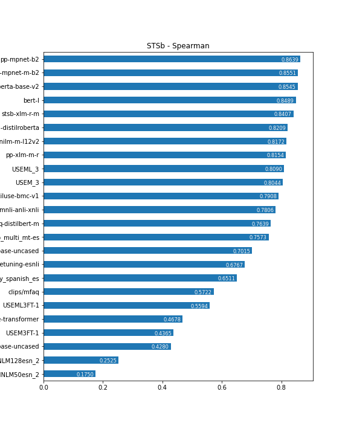
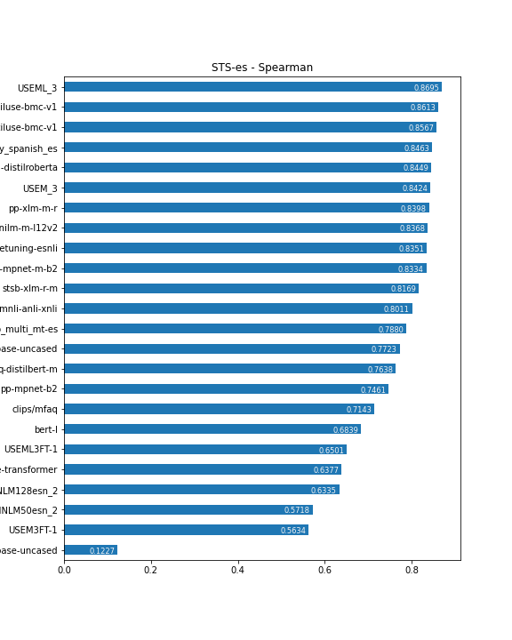

# sts_eval: Easy Evaluation of Semantic Textual Similarity for Neural Language Models

This is a small framework aimed to make easy the evaluation of Language Models with the STS Benchmark as well as other task-specific evaluation datasets. With it you can compare different models, or versions of the same model improved by fine-tuning. The framework currently use **STSBenchmark**, the Spanish portion of **STS2017** and an example of a custom evaluation dataset (**WIP**).

The framework wraps models from different sources and runs the selected evaluation with them, producing a standarized JSON output.

Models can be sourced from:

- [Tensorflow Hub, embedding models](https://tfhub.dev/s?module-type=text-embedding)
- [SBERT Sentence Transformers](https://www.sbert.net/docs/pretrained_models.html)
- [HuggingFace models](https://huggingface.co/models) - IN DEVELOPMENT!!!

### Main Goal: Extension to other evaluation datasets

The main goal of this framework is to help in the evaluation of Language Models for other context-specific tasks. 

**TODO** Example with STS for product names or ad titles

### Evaluation Results on current datasets

Check [this notebook](LanguageModelsSTSEvaluation.ipynb) for the current results of evaluating several LMs on the standard datasets and in the context-specific example. This results closely resembles the ones published in [PapersWithCode](https://paperswithcode.com/sota/semantic-textual-similarity-on-sts-benchmark) and [SBERT Pretrained Models](https://www.sbert.net/docs/pretrained_models.html)

#### STSBenchmark



#### STS-es Spanish to Spanish Semantic Textual Similarity




## Usage

- Build a docker image with all dependecies already integrated from [this repository](https://github.com/eduardofv/ai-denv)

- Clone this repo, and run the prebuilt docker image inside it. (See `denv.sh` in the mentioned repo) 

- Use the main script [sts_evaluation.py](sts_evaluation.py) with the following parameters:

	- Evaluator type: 
		- `tfhub` for *Tensorflow Hub* models that can embed strings directly
		- `sent` for *SentenceTransormers* models
		- `hf` for *HuggingFace* models that can embed strings as AutoML models
	 
	- Model: use the URL, identifier or directory as required by the model.
	- Benchmark: See below for available datasets
		- `stsb-[test|train|dev]` for STSBenchmark specific dataset
		- `sts-es` For SentEval 2017 Spanish to Spanish 
	- *Optional*, similarity metric: 
		- `cosine` (default) or 
		- `euclidean`. Euclidean similarity defined as `1 / (1 + euclidean_distance)`
	- *Optional*, tag: any tag that may help you to identify this particular run.


```
tf-docker /root > python sts_evaluation.py sent stsb-roberta-base-v2 stsb-test cosine 2> /dev/null 1> results/stsb--stsb-roberta-base-v2.json 
```

Output JSON example:

```
{
    "class": "SentenceTransformerSTSEvaluator",
    "model_url": "stsb-roberta-base-v2",
    "data_filename": "data/stsbenchmark/sts-dev.csv",
    "used_minimal_normalization": null,
    "metric": "cosine",
    "scaled_scores": null,
    "evaluation": {
        "pearson": {
            "r": 0.8872942593119845,
            "p-value": 0.0
        },
        "spearman": {
            "rho": 0.8861646506975909,
            "p-value": 0.0
        }
    },
    "timestamp": "2021-06-14 23:13:05",
    "metadata": [],
    "tag": "stsb--roberta_base_v2-cosine",
    "benchmark": "stsbenchmark"
}
```

## Datasets

### STS Benchmark

http://ixa2.si.ehu.eus/stswiki/index.php/STSbenchmark

https://paperswithcode.com/sota/semantic-textual-similarity-on-sts-benchmark

### SemEval 2017

For Spanish monolingual texts:

https://alt.qcri.org/semeval2017/task1/

### SentEval (Facebook)

https://github.com/facebookresearch/SentEval

